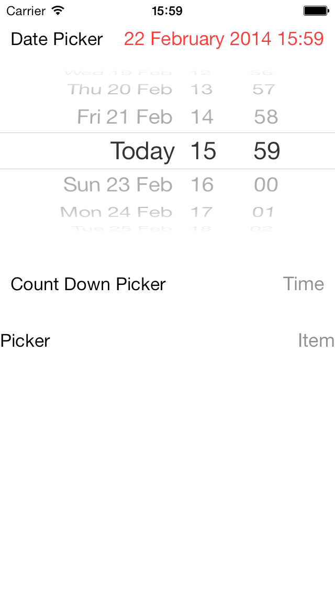

RDHExpandingPickerViews
=======================

Installation:
``` ruby 
pod 'RDHExpandingPickerViews'
```

Inline view that expands to show a `UIPickerView`/`UIDatePickerView`.

The two classes `RDHExpandingDatePickerView` and `RDHExpandingPickerView` are a container around their respective pickers.

Checkout the [online documentation](#documentation) for more customisation. 

The default look is exactly the same as the date picker in the Calendar application on iOS.



Date picker
-----------

`RDHExpandingDatePickerView` provides access to the backing `UIDatePicker` allowing customisation of the picker mode.

Picker
------

`RDHExpandingPickerView` does not expose the backing `UIPickerView` as there is not much that can be customised on the standard picker. Instead there is a `RDHExpandingPickerViewDataSource` to provide backing data, and `RDHExpandingPickerViewDelegate` to react to changes in the picker as well as the display values.

Documentation
-------------
[Online docs](http://cocoadocs.org/docsets/RDHExpandingPickerViews)

[Docset for xcode](http://cocoadocs.org/docsets/RDHExpandingPickerViews/xcode-docset.atom)

[Docset for Dash](dash-feed://http%3A%2F%2Fcocoadocs.org%2Fdocsets%2FRDHExpandingPickerViews%2FRDHExpandingPickerViews.xml)
